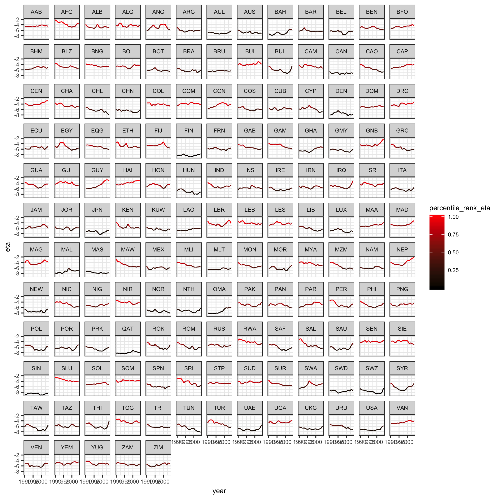
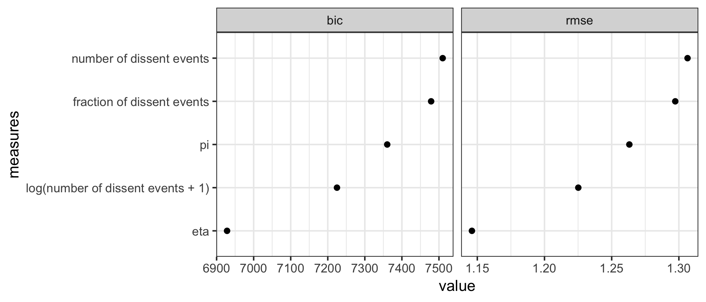
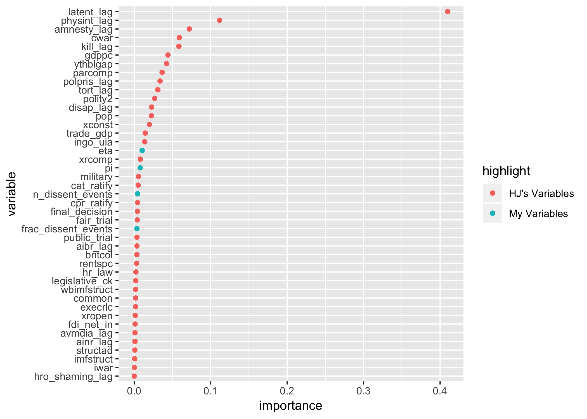

# A Latent Measure of Dissent

This code serves as a proof of concept that I wanted to share with colleagues to determines its potential usefulness. This code borrows heavily from work by Emily Ritter, especially her 2014 paper "Policy Disputes, Political Survival, and the Onset and Severity of State dissent" in *JCR*. You can find the details on her [research page](https://www.emilyhenckenritter.com/research/), including her [replication data (`.zip`)](https://www.emilyhenckenritter.com/s/RitterJCR2014Replication.zip) that I use in my analysis.

The output is a country-year data set that contains two latent measures of dissent (`pi` and `eta`). These data sets (`latent-dissent.csv` and `latent-dissent.dta`) contain the following six variables:

- `n_dissent_events`: the number of dissent events that occur in a country-year. Based on the IDEA data, see Ritter (2014).
- `dissent_event_frac`: the fraction of the events that occur in a country-year in the IDEA data that are dissent.
- `pi`: the latent probability that an event is dissent. This latent measure of dissent ranges from zero to one (at least in theory).
- `eta`: The inverse logit transformation of `pi`. This latent measure of dissent ranges from negative to positive infinity (again, in theory.)
- `year` and `ccode`: the year and COW code for merging.

## The Data

The figure below shows the latent measure of dissent, `eta`, that makes the most theoretical sense to me. It also turns out that this measure predicts repression better than the other three.

## The Model

The model is straightforward, but GitHub doesn't render math. In short, I model the number of dissent events in country *j* at time *t* as following a binomial distribution where the number of trials (i.e., *n* in Wikipedia's notation) is given by the total number of events for *i,j* and the probability of success varies across time. Within each country, I use a random walk prior to model the changes in the probability of success across time. For the details, see the Stan model [here](src/binomial.stan).

## Fitting the Model

I use Stan to fit the model. This offers a tremendous advantage because Stan can quickly convert between HMC-NUTS and variational inference. Variational inference is extremely useful for this problem, because it allows us to quickly simulate from an approximate posterior, even when the model contains hundreds of thousands of parameters. This isn't particularly important for yearly data, but variational inference can handle daily data from 200 countries over 50 years almost as quickly.

## Quick Evaluations of the Measures

To obtain an initial sense of how well the four alternative measure of dissent explain the variation in dissent. I conducted two rough analyses.

First, I use the four measures of dissent to predict Fariss's [latent measure of repression](http://humanrightsscores.org). These are just linear regressions with a single explanatory variable (one regression for each measure of dissent) predicting Fariss's measure of repression. As one would probabily expect/hope, the *latent* measures perform best and `eta` (along the entire real line) outperforms `pi` (in the interval (0, 1)). The figure below shows the BIC and (in-sample) R.M.S. error of the regressions.

Second, I did a re-analysis in the spirit of [Hill and Jones (2014)](https://github.com/zmjones/eeesr). I just added my four explanatory variables to their large suite of other explanatory variables. I tossed all these variables into a random forest and computed the variable importance. The latent measures of dissent aren't as important as the lagged measures of repression or civil war, but they do better than about half of Hill and Jones' collection. Again, `eta` outperforms the other measures. The figures below compare the variable importance of the many potential predictors of repression.

