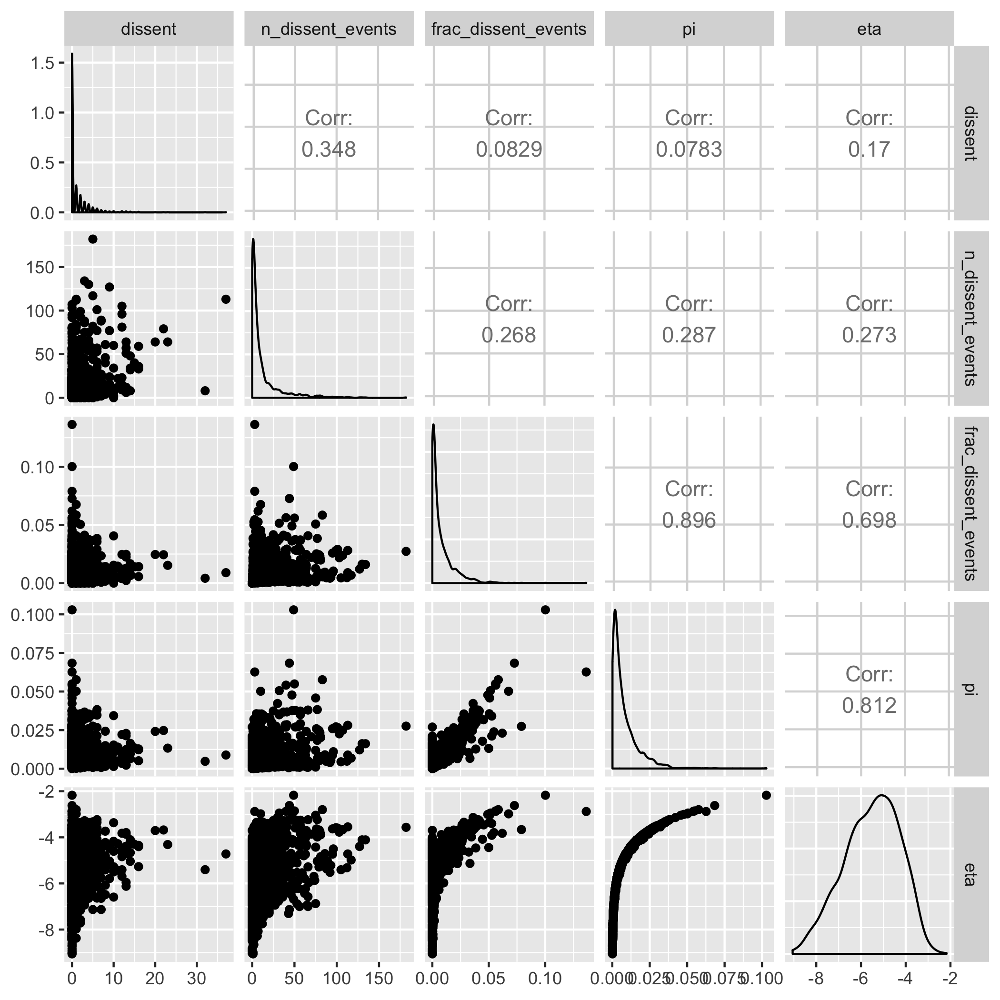
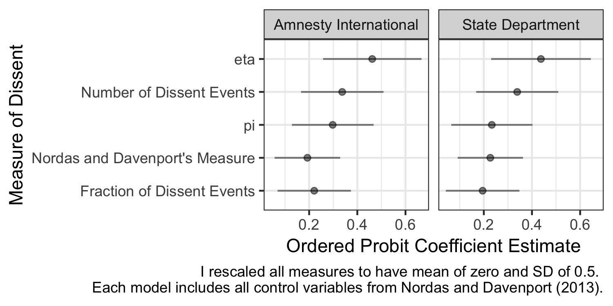

*A note about reproducibility:* The repo does not contain the raw data (GitHub size limitations), but you can automatically download and clean them with `make data` (or running R scripts `00-*` through `05-*`), producing several intermediate data sets and the cleaned data set `data/idea-counts.csv` that I use to fit the model. The repo *does* contain `data/idea-counts.csv`, so, even without the raw data, you can fit the model with `make model`  (or running R script `06-*`) and perform the tests with `make tests` (or running R scripts `07-*`, `08-*`, and `tests-*`). Reproduce the entire analysis (from raw data to tests) with `make` or `make all`.

# A Latent Measure of Dissent

This code serves as a proof of concept that I wanted to share with colleagues to determine its potential usefulness. The original data come from King and Lowe's "10 Million International Dyadic Events" on [Dataverse](http://hdl.handle.net/1902.1/FYXLAWZRIA). 

In previous versions, I borrowed heavily from data created and shared by Emily Ritter, especially her 2014 paper "Policy Disputes, Political Survival, and the Onset and Severity of State dissent" in *JCR*. You can find the details on her [research page](https://www.emilyhenckenritter.com/research/), including her [replication data (`.zip`)](https://www.emilyhenckenritter.com/s/RitterJCR2014Replication.zip) that I use in my analysis.

I also relied on written work and replication data publicly posted by [Amanda Murdie](http://www.amandamurdie.org/index.html), especially her 2011 paper "Aiding and Abetting: Human Rights INGOs and Domestic Protest" in *JCR* with Tavishi Bhasin.

The output is a country-year data set that contains two latent measures of dissent (`pi` and `eta`). These data sets (`latent-dissent.csv` and `latent-dissent.dta`) contain the following six variables:

- `n_dissent_events`: the number of dissent events that occur in a country-year. Based on the IDEA data, see Ritter (2014).
- `frac_dissent_events`: the fraction of the events that occur in a country-year. It's the number of dissent events divided by the total number of events.
- `pi`: the latent probability that an event is a dissent event. This latent measure of dissent ranges from zero to one (at least in theory).
- `eta`: The logit transformation of `pi`. This latent measure of dissent ranges from negative to positive infinity (again, in theory.)
- `year` and `ccode`: the year and COW code for merging.

To load the data into R directly from GitHub, you can use the following, which will always give you the latest version:

    dissent <- rio::import("https://raw.githubusercontent.com/carlislerainey/latent-dissent/master/latent-dissent.csv")

You can download the `.dta` file by clicking [here](https://github.com/carlislerainey/latent-dissent/blob/master/latent-dissent.dta?raw=true).  
## The Data

The figure below shows the relationships among the four measures of dissent. Notice that these measures are relatively uncorrelated with each other.

The figure below shows the latent measure of dissent, `eta`, that makes the most theoretical sense to me. It also turns out that this measure predicts repression better than the other three (see below).

## The Model

In short, I model the number of dissent events in country *j* at time *t* as following a binomial distribution.

I'm interpreting `eta` and `pi` as latent measures of dissent.

Notice that I just use a random walk prior to model the changes in the probability of success across time. For the details, see the Stan model [here](src/binomial.stan).

## Fitting the Model

I use Stan to fit the model. This offers a tremendous advantage because Stan can quickly convert between HMC-NUTS and variational inference. Variational inference is extremely useful for this problem, because it allows us to quickly simulate from an approximate posterior, even when the model contains hundreds of thousands of parameters.

## Quick Evaluations of the Measures

To obtain an initial sense of how well the four alternative measure of dissent explain the variation in dissent. I conducted two rough analyses.

First, I use the four measures of dissent to predict Fariss's [latent measure of repression](http://humanrightsscores.org). These are just linear regressions with a single explanatory variable (one regression for each measure of dissent) predicting Fariss's measure of repression. As one would probably expect/hope, the *latent* measures perform best and `eta` (along the entire real line) outperforms `pi` (in the interval (0, 1)). The figure below shows the BIC and (in-sample) R.M.S. error of the regressions.

Second, I did a re-analysis in the spirit of [Hill and Jones (2014)](https://github.com/zmjones/eeesr). I just added my four explanatory variables to their large suite of other explanatory variables. I tossed all these variables into a random forest and computed the variable importance. The latent measures of dissent aren't as important as the lagged measures of repression or civil war, but they do better than about half of Hill and Jones' collection. Again, `eta` outperforms the other measures. The figures below compare the variable importance of the many potential predictors of repression.

Third, I re-fitted the models in Nordas and Davenport (2013). The figures below show the correlations among the measures in my data set and their `dissent` measure. I also show the BIC for the five measures (their one and my four) for the models predicting both the Amnesty and the State outcomes. Finally, I included the table of coefficients for their model predicting the Amnesty outcomes. Notice three things: (1) the measures aren't terribly correlation with each other, (2) again, `eta` predicts best (smallest BIC), and (3) is has the largest effect of all the measure, roughly doubling the estimate for Nordas and Davenport's `dissent` (both are standardized to have and average of 1 and and SD of 0.5, so the coefficient magnitudes are comparable.)

